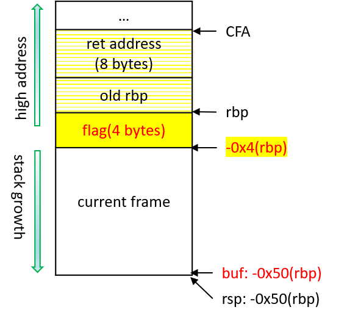

# Chapter 1. Stack Smashing
In this chapter, we discuss the most common and easy-to-understand memory-safety problems: stack buffer overflow. An attacker could leverage such bugs to modity the stack and achieve malicious goals, knowning as stack smashing. We will not dive into the technical details of exploit writting (there are many such tutorials and tools available online, e.g., for CTF training) but mainly discuss why such bugs are dangerous and show how attacks could happen in practice. 

## Section 1. Stack Smashing

### Warm Up
Let's use the following code snippet as a toy example, which contains a validation process that requires the user to input a key to pass the validation. The code contains a buffer overflow bug because the length of buf is 64 while it may read 160 byte data. Supposing the user neither know a valid key nor can obtain the source code. How can he find a key to pass the validation? 

```
int validation() {
    char buf[64];
    read(STDIN_FILENO, buf, 160);
    if(buf[0]=='$'){ //any code to check the input
        write(STDOUT_FILENO, "Key verified!\n", 14);
        return 1;
    }else{
    	write(STDOUT_FILENO, "Wrong key!\n", 11);
    }
    return 0;
}
```
The trick lies in the stack layout, and we can obtain the layout by analyzing its assembly code.
```
0x401150 <+0>:     push   %rbp
0x401151 <+1>:     mov    %rsp,%rbp
0x401154 <+4>:     sub    $0x50,%rsp
0x401158 <+8>:     xor    %edi,%edi
0x40115a <+10>:    lea    -0x50(%rbp),%rsi
0x40115e <+14>:    mov    $0xa0,%edx
0x401163 <+19>:    callq  0x401050 <read@plt>
0x401168 <+24>:    movsbl -0x50(%rbp),%ecx
0x40116c <+28>:    cmp    $0x24,%ecx
0x40116f <+31>:    jne    0x40119a <+74>
0x401175 <+37>:    mov    $0x1,%edi
0x40117a <+42>:    movabs $0x402004,%rsi
0x401184 <+52>:    mov    $0xe,%edx
0x401189 <+57>:    callq  0x401030 <write@plt>
0x40118e <+62>:    movl   $0x1,-0x4(%rbp)
0x401195 <+69>:    jmpq   0x4011ba <+106>
0x40119a <+74>:    mov    $0x1,%edi
0x40119f <+79>:    movabs $0x402013,%rsi
0x4011a9 <+89>:    mov    $0xb,%edx
0x4011ae <+94>:    callq  0x401030 <write@plt>
0x4011b3 <+99>:    movl   $0x0,-0x4(%rbp)
0x4011ba <+106>:   mov    -0x4(%rbp),%eax
0x4011bd <+109>:   add    $0x50,%rsp
0x4011c1 <+113>:   pop    %rbp
0x4011c2 <+114>:   retq
```


Let's assume the our porpose is to enforce the function to return 1, so we can trace the data flow of the return value backwards. Starting from Line <+106>, we know the return value of the register (%eax) is moved from the stack -0x4(%rbp). Line <+99> saves 0x0 to -0x4(%rbp), while Line <+62> saves 0x1 to -0x4(%rbp). So we can tamper the buffer of -0x4(%rbp) to bypass the validation. Line <+4> tells us the assembly code increases the stack size with 0x50. We can compute the offset of -0x4(%rbp) to the register %rsp should be 0x4b or 76 in decimal. In order to let the function return 1, we can input a 76-byte buf with the last four bytes to be 1.

### Steps of Stack Smashing
- Step 1. Detect buffer overflow bugs: Find an input that crashes a program e.g., via fuzz testing. 
- Step 2. Analyze stack layout of the buggy code
- Step 3. Design the exploit: To obtain the shell. e.g., with return-oriented programming

## Section 2. Protection Techniques
