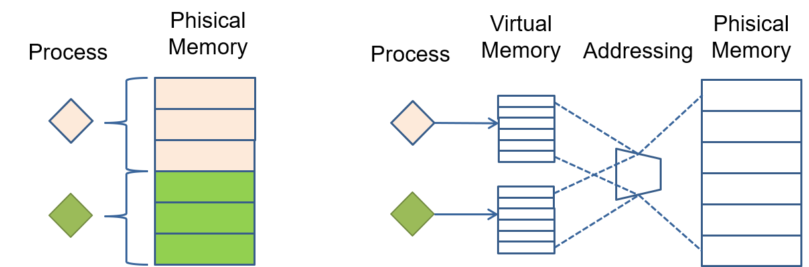
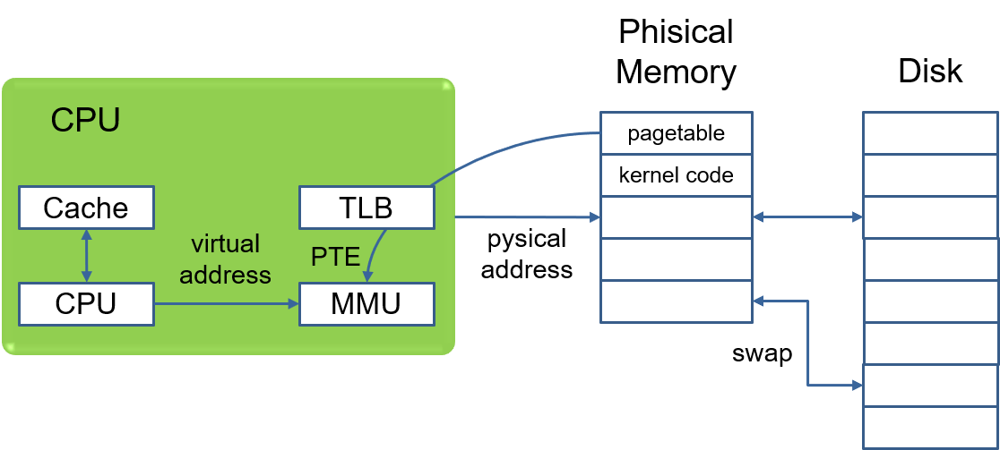
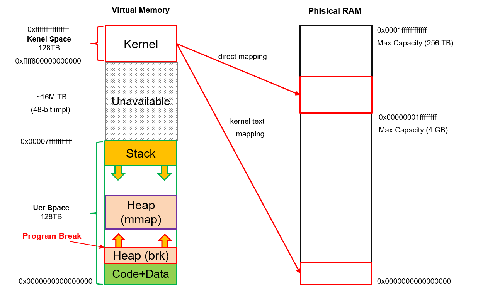
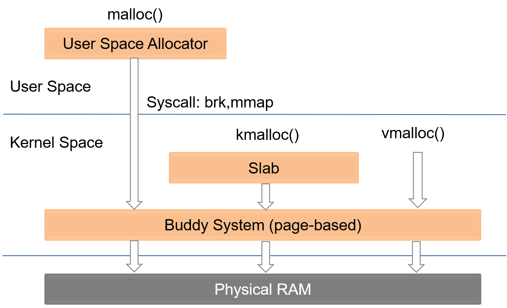

# Chapter 2. Allocator Design
## Section 2.1 Memory Management Overview
How does a process access the RAM? If there the RAM is uniquely owned by the process, it can directly read/write the RAM cells with the phisical address. However, if the RAM is shared among several processes, we should divide the phisical address space into different realms. This can be achieved either via direct segmentation (or unikernel) or virtual memory addressing. Due to the limitations in flexibility and security, unikernel is mainly used in embeded systems and LibOSes, while virtual memory addressing becomes the most popular way for PCs and Servers.


In vitual memory addressing, each process can only use the virtual address to access the memory. The virtual memory space of each process are exactly the same, and MMU on the Chip translates the virtual address of different processes to the corresponding phisical address automatically. This enforces the seperation of phisical memory usage. 


The following figure demonstrates a simple mapping between the virtual memory space and phisical memory space in some X86_64 systems (48-bit version). The virtual memory spaces of X86_64 ranges from 0x0000000000000000 - 0xffffffffffffffff. While memory addresses above 0xffff800000000000 are reserved for kernel usage, and addresses below 0x00007fffffffffff are reserved for user space. Since current X86_64 solutions mainly implements the 48-bit version, memory addresses in the middle are unused.The kernel space memory layout is the same for current processes running on the same operating system. As discribed in the document of ["Complete virtual memory map with 4-level page tables"](https://www.kernel.org/doc/Documentation/x86/x86_64/mm.txt), the kernel text is mapped to phisical address 0, and there is another kernel address range directly mapped to the phisical memory space. We will not go into the detailed mappings here. You only need to know the kernel code can easily calculate the physical address of a virtual memmory address in the kernel space via some offsets. 


You can check the virtual memory layout of a process throgh the /proc/pid/maps file and obtain some phisical memory layout information using the dmesg command.
```
#: cat /proc/pid/maps
#: dmesg
```

To facialiate the dynamic allocation and deallocation of virtual memories, the operating system provides a buddy system for memory management. As shown below, kernel code can use kmalloc() or vmalloc() to allocate memories through the buddy system. User space code should use system calls like brk and mmap to request memries through the buddy system. Such system calls are wrapped as allocation functions. Next, we elaborate the key challenges and solutions for kernel space memory management and user space memory management.


## Section 2.2 Kernel Space Allocator
The main functionality requirement of a kernel space allocator is to 1) allocate memory trunks based on the required size and 2) reclaim the memory once freed. Such operations should be done efficiently because kernel code is used by all processes. This is not difficult if not considering the fragmentation issues. However, as memory trunks are allocated and deallocated randomly, it will leave unused spaces between used trunks. If our allocation method tends to cut large unused trunks to meet the request of a small trunk, such unused spaces would become smaller and less reusable, knowing as fragmentation. To deal with the fragmentation issue, the allocation should be able to colase neighbor trunks if they are both free. The colasing algorithm should be efficient.


## Section 2.3 User Space Allocator
