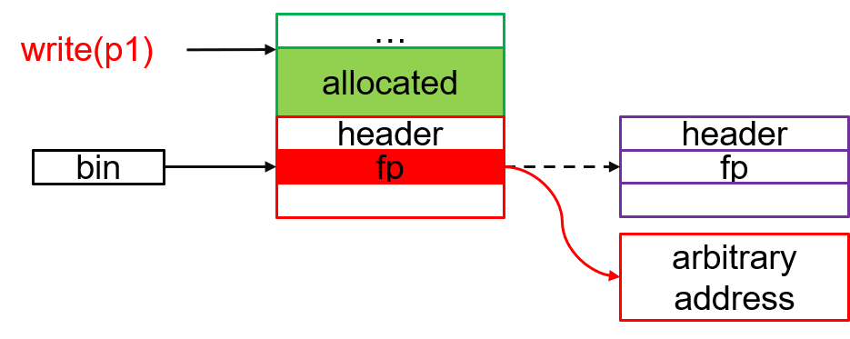
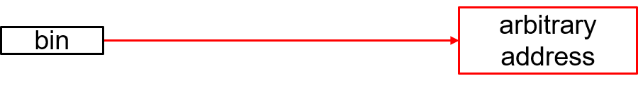
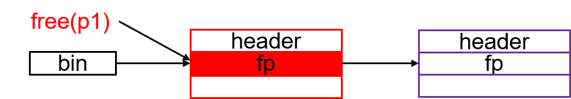
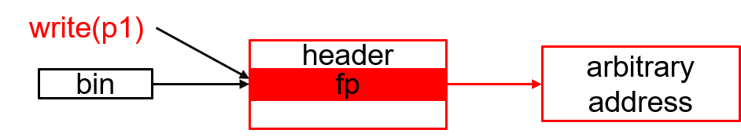
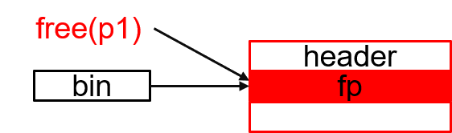
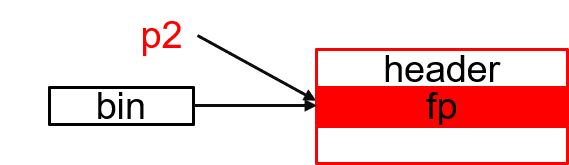

# Chapter 2. Heap Attack
## Section 2.1 Heap Analysis

## Section 2.2 Heap Attack
To simplify our discussion, let's suppose the purpose of the attack is to obtain a pointer to an arbitrary address of our interest so that we can modify the data of the memory address. For example, we are interested in the return address because we may launch return-oriented programming attacks. We are also interested in the Global Offset Table (GOT) which maintains the addressing information of dynamic linked functions or position-independent code. For instance, wen may change the table entry of the widely used strcpy() function to a piece of malicious code. The similar method also applies to the Virtual Method Table (vtable) of C++/Rust code. 

To simplify the attacking scenario, we assume there is one free list. Therefore, all malloc() and free() operations will be performed based on the same list. In practice, there could be several bins, and each bin could have several lists of different sized chunks, which increases the complexity of attacks.

### 2.2.1 Heap Overflow Attack
Suppose p1 is a pointer to a heap chunk, and we can write beyond the chunk end through p1, i.e., with heap overflow issues. We may leverage the bug to modify the forward pointer of a following chunk if it is free. As shown in the figure below, the original forward pointer points to the next free chunk. To attack the bug, we can change the forward pointer to an arbitrary address of our interest. To this end, we should compute the offset of the forward pointer based on the size the current chunk. If the following chunk is not free, we should continue search other following chunks. 


Now, if we call the malloc(), it will remove the first chunk of the bin and point the bin head to the address of our interest.  


Calling the malloc() again would gain a pointer to the arbitrary address.


### 2.2.2 Use-After-Free Attack
Attacking use after free is similar to and even easier than attacking heap overflow. After freeing a pointer p1, p1 stills points to the freed chunk.


Therefore, we can directly modify the forward pointer of the free chunks via p1. The rest steps are the same as those of the heap overflow attack. Different from heap overflow attack, we do not need to calculate the offset of the forward pointer based on p1.


### 2.2.2 Double Free Attack
Suppose a free chunk pointed by p1 is already in the free list. Freeing p1 one more time executes the following link code.
```
p1->next = head->next;
head->next = p1;
```
As a result, it would incur a self-linked chunk and breaks the list.


Now we call malloc(), and it shoud unlink the chunk based on the following code.
```
p2 = head->next;
head->next = p2->next;
```
In this way, we obtain a pointer p2 to an allocatedchunk, but the chunk is also on the list. We can leverage p2 to modify the forward pointer of the chunk. The rest steps are the same as those of the previous attacks. 


## Section 2.3 Protection Techniques
